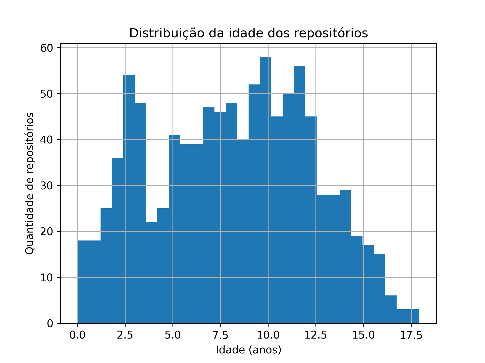
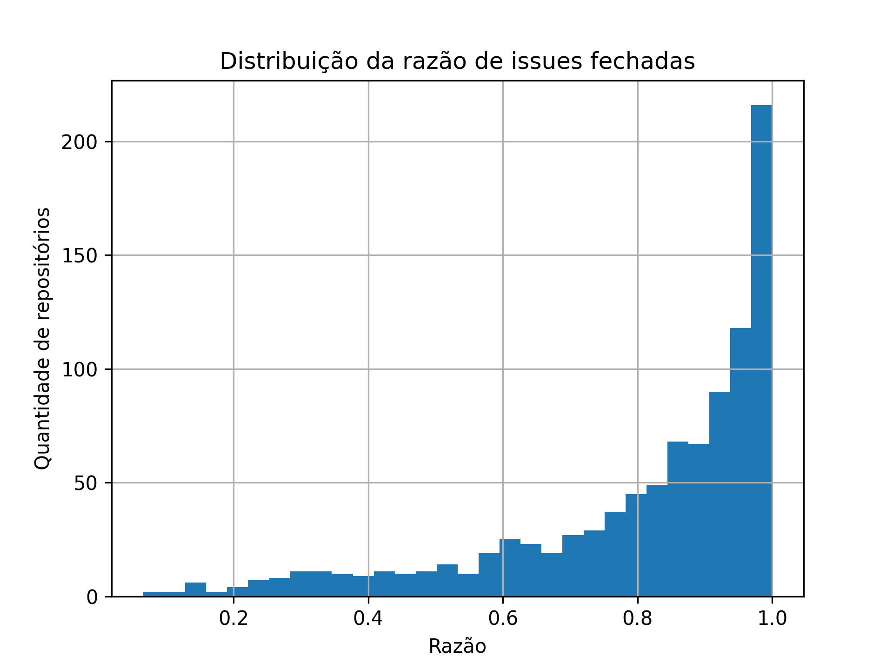
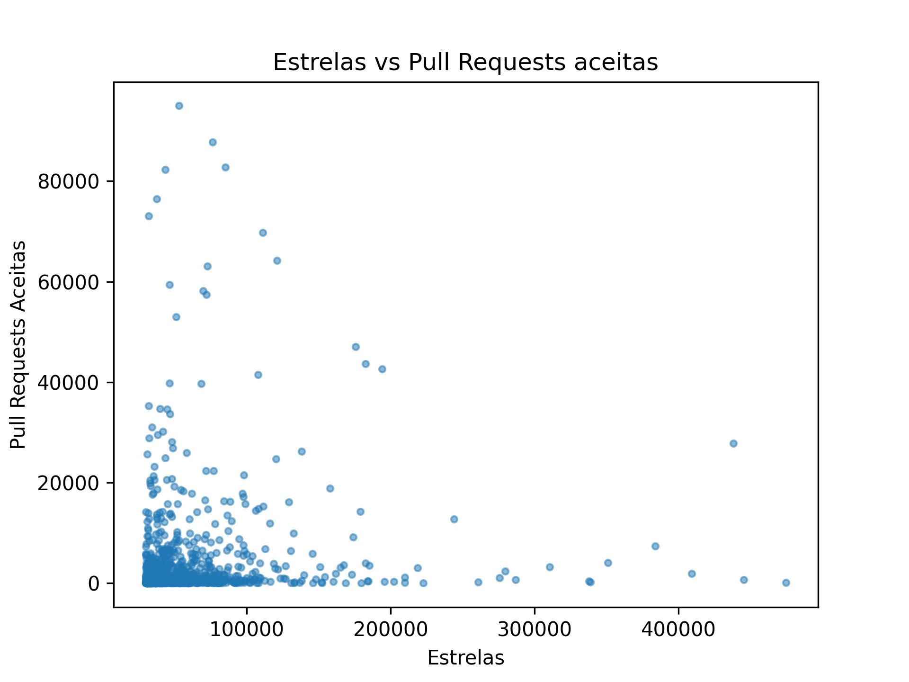
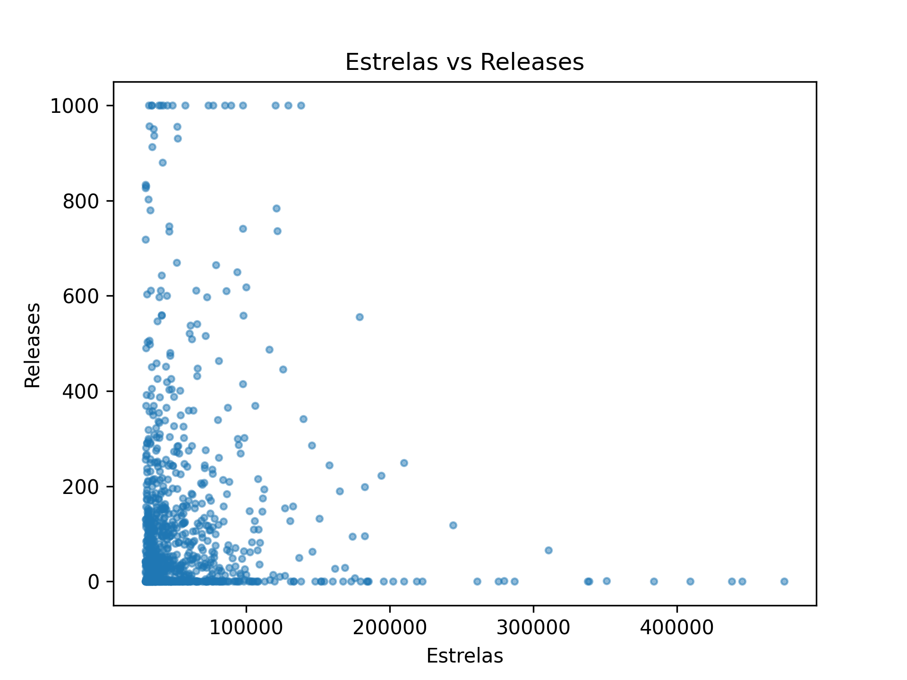
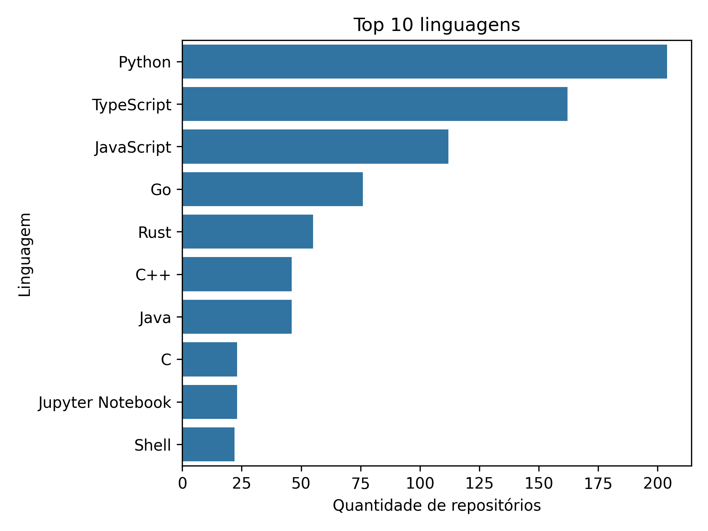
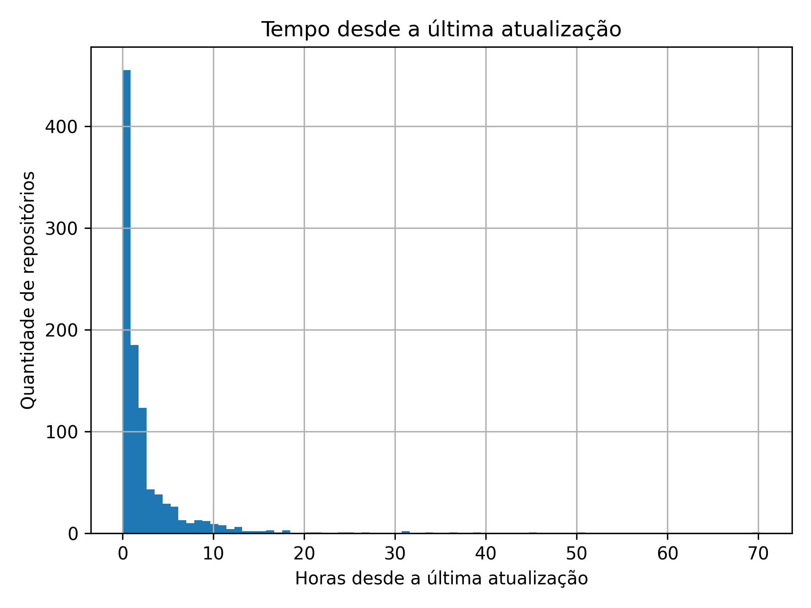
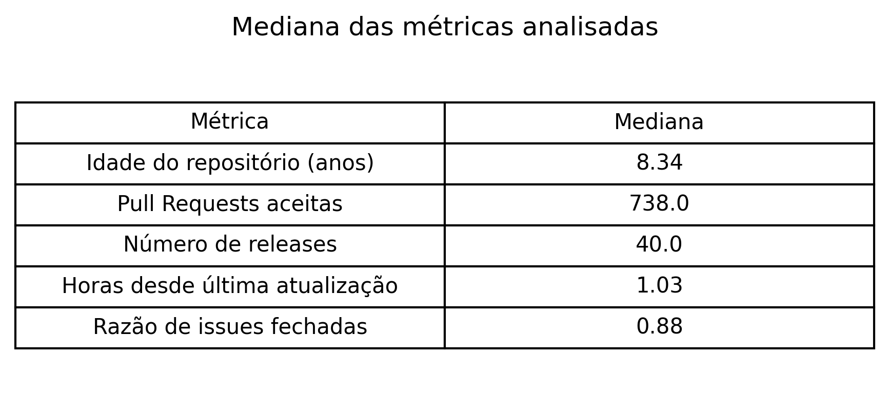

# Análise de Repositórios Populares no GitHub

## 1. Introdução

### Contextualização

Plataformas de desenvolvimento colaborativo como o GitHub permitem que projetos de software open source sejam desenvolvidos de forma coletiva e distribuída. Muitos desses projetos alcançam grande popularidade, refletida principalmente pelo número de estrelas (stars) recebidas.

A popularidade de um repositório pode estar relacionada a diversos fatores, como maturidade do projeto, atividade de desenvolvimento, participação da comunidade e qualidade da manutenção.

---

### Problema foco do experimento

Apesar da popularidade de muitos repositórios no GitHub, nem sempre é claro quais características estão associadas a esse sucesso. Dessa forma, surge a necessidade de investigar se projetos populares apresentam padrões específicos em relação à idade do projeto, contribuições externas, frequência de atualizações, releases, linguagens populares e gestão de issues.

---

### Questões de Pesquisa

As seguintes questões de pesquisa foram definidas:

**RQ01:** Sistemas populares são maduros ou antigos?  
*Métrica:* idade do repositório.

**RQ02:** Sistemas populares recebem muita contribuição externa?  
*Métrica:* número de pull requests aceitas.

**RQ03:** Sistemas populares lançam releases com frequência?  
*Métrica:* número total de releases.

**RQ04:** Sistemas populares são atualizados com frequência?  
*Métrica:* tempo desde a última atualização.

**RQ05:** Sistemas populares são escritos nas linguagens mais populares?  
*Métrica:* linguagem principal do repositório.

**RQ06:** Sistemas populares possuem um alto percentual de issues fechadas?  
*Métrica:* razão entre issues fechadas e total de issues.

---

### Hipóteses

Antes da análise dos dados, foram consideradas as seguintes hipóteses:

- Projetos populares tendem a ser mais antigos, pois tiveram mais tempo para crescer.
- Projetos populares recebem mais contribuições da comunidade.
- Projetos populares lançam versões com frequência.
- Projetos populares são atualizados regularmente.
- Projetos populares utilizam linguagens amplamente adotadas.
- Projetos populares possuem boa gestão de issues.

---

### Objetivo

#### Objetivo principal

Analisar características de repositórios populares do GitHub para identificar padrões relacionados à maturidade, manutenção e participação da comunidade.

#### Objetivos específicos

- Avaliar a idade média dos repositórios populares.
- Analisar o nível de contribuição externa.
- Verificar a frequência de releases.
- Avaliar a frequência de atualizações.
- Identificar as linguagens mais utilizadas.
- Analisar a taxa de resolução de issues.

---

# 2. Metodologia

### Passo a passo do experimento

1. Coleta de dados de repositórios populares do GitHub.
2. Armazenamento das informações em um arquivo CSV.
3. Processamento dos dados utilizando Python.
4. Cálculo das métricas definidas para cada questão de pesquisa.
5. Geração de gráficos para visualização dos dados.
6. Análise estatística utilizando valores de mediana.

---

### Decisões

Algumas decisões metodológicas foram tomadas durante a análise:

- Utilização da **mediana** como medida de tendência central, pois ela é menos sensível a valores extremos.
- Uso de gráficos para facilitar a visualização da distribuição dos dados.
- Análise baseada em métricas quantitativas extraídas diretamente dos repositórios.

---

### Materiais utilizados

A análise foi realizada utilizando as seguintes ferramentas:

- Linguagem de programação **Python**
- Biblioteca **Pandas** para manipulação de dados
- Biblioteca **Matplotlib** para geração de gráficos
- Arquivo CSV contendo os dados dos repositórios analisados

---

### Métodos utilizados

Os dados foram processados utilizando técnicas básicas de análise exploratória de dados, incluindo:

- cálculo de mediana
- contagem por categoria
- visualização gráfica da distribuição das métricas

---

### Métricas e unidades

| Métrica | Unidade |
|------|------|
| Idade do repositório | anos |
| Pull requests aceitas | quantidade |
| Número de releases | quantidade |
| Tempo desde última atualização | horas |
| Linguagem principal | categoria |
| Razão de issues fechadas | valor entre 0 e 1 |

---

# 3. Visualização dos Resultados

Foram gerados gráficos para representar a distribuição das principais métricas analisadas.

### Idade dos repositórios

---

### Razão de issues fechadas

---

### Relação entre estrelas e pull requests

---

### Relação entre estrelas e releases

---

### Linguagens mais utilizadas

---

### Tempo desde a última atualização

---

### Mediana das métricas analisadas

A tabela abaixo apresenta a mediana das métricas utilizadas no estudo.

---

# 4. Discussão dos Resultados

### Confronto com as questões de pesquisa

**RQ01 – Maturidade dos sistemas**

Os dados da distribuição da idade revelam que a popularidade não é um fenômeno imediato. A maioria dos repositórios concentra-se na faixa de 2,5 a 12,5 anos. Nota-se um pico significativo em projetos com aproximadamente 3 anos e outro platô de maturidade entre 7 e 10 anos. Projetos com menos de 2 anos são minoria, o que confirma que o acúmulo de estrelas está fortemente ligado ao tempo de exposição e maturação do software.

Com uma mediana de 8,34 anos, os resultados confirmam que a maturidade é um pilar da popularidade. Embora o gráfico de distribuição mostre projetos ativos desde os 2 anos, o "corpo" principal da amostra sobreviveu ao teste do tempo, acumulando estrelas e confiança da comunidade ao longo de quase uma década.

---

**RQ02 – Contribuições externas**

O gráfico de Estrelas vs Pull Requests (PRs) mostra que não há uma correlação linear perfeita, mas sim uma tendência de alta atividade. Enquanto a massa de projetos possui até 20.000 PRs, existem casos extremos (outliers) com mais de 80.000 PRs aceitas. Curiosamente, alguns dos repositórios com o maior número de estrelas (acima de 300k) possuem menos PRs que projetos de médio porte, sugerindo que projetos extremamente populares podem ser informativos (curadorias) ou ter um núcleo de contribuidores mais restrito.

A mediana de 738 PRs aceitas revela um nível de engajamento comunitário robusto. Embora o gráfico de dispersão mostre casos excepcionais com dezenas de milhares de PRs, o valor central de 746 demonstra que, para ser popular, o repositório geralmente precisa estar aberto e aceitar contribuições externas de forma regular.

---

**RQ03 – Releases**

A análise de Estrelas vs Releases indica um padrão de manutenção contínua. Observa-se uma concentração densa de projetos que atingiram o teto de 1.000 releases (limite de plotagem/coleta), independentemente do volume de estrelas. Isso sugere que a entrega contínua de valor é uma característica intrínseca de quase todos os repositórios populares no GitHub.

A mediana de 40 releases indica que esses sistemas não são estáticos. Existe um ciclo de vida de software bem definido, com entregas de versões que garantem a estabilidade e a evolução do projeto para os usuários finais.

---

**RQ04 – Atualizações**

Este é um dos pontos mais contundentes do experimento. O gráfico de Tempo desde a última atualização mostra que a vasta maioria dos repositórios foi atualizada há menos de 5 horas. A frequência de projetos que ficam mais de 10 horas sem atualizações cai drasticamente, o que demonstra que a popularidade exige (ou resulta em) uma manutenção praticamente em tempo real.

A mediana de 1,03 hora desde a última atualização mostra que o tempo de resposta e a manutenção são quase imediatos. Isso sugere que a popularidade está diretamente vinculada à percepção de um projeto "vivo" e bem cuidado.

---

**RQ05 – Linguagens utilizadas**

As linguagens mais populares, segundo matéria publicada no blog oficial do Github em 28 de outubro de 2025, são, na ordem:
1. TypeScript
2. Python
3. JavaScript
4. Java
5. C#

A análise da amostra coletada revela uma forte predominância de Python (mais de 200 repositórios), seguido por TypeScript e JavaScript. No entanto, ao confrontar esses resultados com o relatório oficial do GitHub (outubro de 2025), observamos uma inversão interessante:

Na amostra do experimento: O Python lidera, possivelmente devido à explosão de repositórios populares voltados para Inteligência Artificial e Ciência de Dados.

No ecossistema global (GitHub 2025): O TypeScript consolidou-se como a linguagem número 1, refletindo a migração massiva de projetos JavaScript para tipos estáticos em busca de escalabilidade e segurança.

A presença de Java e C# nas posições 4 e 5 do ranking global, embora apareçam com menos volume na nossa amostra de "estrelas", reforça que as linguagens corporativas tradicionais mantêm uma base sólida de desenvolvimento, enquanto linguagens como Go e Rust (fortes na nossa amostra) ganham tração rápida em projetos open source de infraestrutura moderna.

---

**RQ06 – Gestão de issues**

A distribuição da razão de issues fechadas apresenta uma assimetria negativa extrema. A barra de frequência mais alta está no índice 1.0 (100% de fechamento). Isso prova que uma gestão de issues extremamente eficiente é um padrão ouro entre os repositórios mais populares, refletindo um alto nível de suporte e atenção aos problemas reportados pelos usuários.

A mediana da razão de fechamento de 0,88 (88%) é um indicador de excelência na manutenção. Manter quase 9 de cada 10 issues fechadas demonstra que os mantenedores de projetos populares priorizam o feedback da comunidade e possuem processos eficientes de correção de bugs e melhorias.

---

### Insights

Alguns insights importantes observados:

- projetos populares tendem a ser relativamente maduros
- a participação da comunidade é relevante para os projetos
- a maioria mantém boa gestão de issues
- linguagens populares aparecem com frequência

---

# 5. Conclusão

Os resultados obtidos indicam que repositórios populares no GitHub apresentam características comuns relacionadas à maturidade do projeto, participação da comunidade e manutenção ativa.

Observou-se que muitos projetos possuem vários anos de desenvolvimento, recebem contribuições externas e apresentam altas taxas de resolução de issues.

Esses fatores sugerem que a popularidade de um projeto pode estar associada tanto à sua longevidade quanto ao nível de engajamento da comunidade.

---

### Sugestões futuras

Como trabalhos futuros, seria interessante:

- analisar um conjunto maior de repositórios
- incluir métricas adicionais de atividade de desenvolvimento
- comparar projetos de diferentes categorias ou domínios
- avaliar a evolução temporal das métricas analisadas

---

# Referências
GITHUB. Octoverse: A new developer joins GitHub every second as AI leads TypeScript to #1. GitHub Blog, 28 out. 2025. Disponível em: https://github.blog/news-insights/octoverse/octoverse-a-new-developer-joins-github-every-second-as-ai-leads-typescript-to-1/. Acesso em: 13 mar. 2026.
